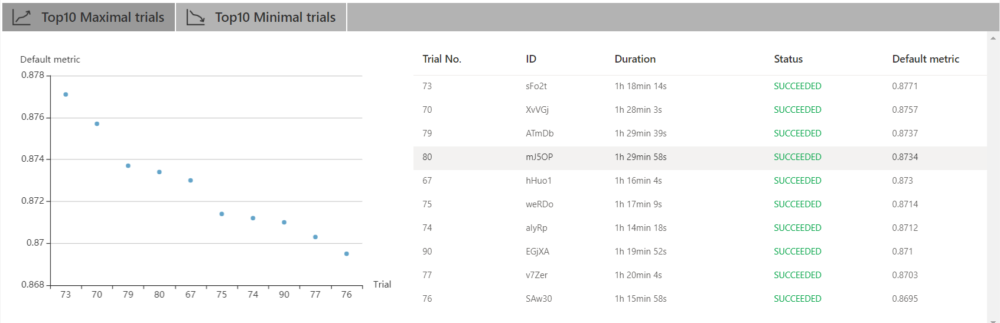
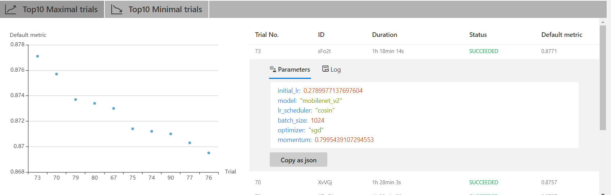
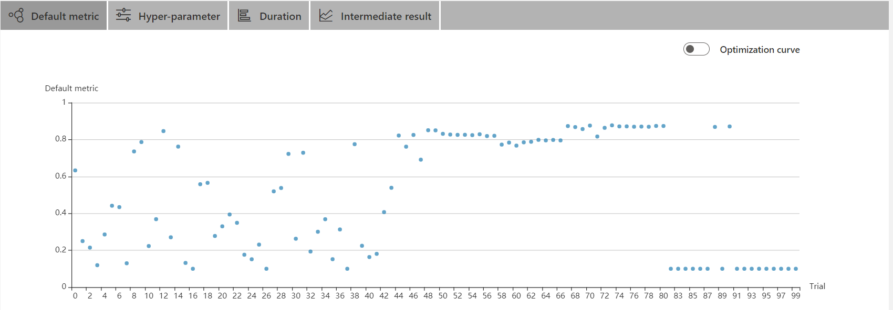
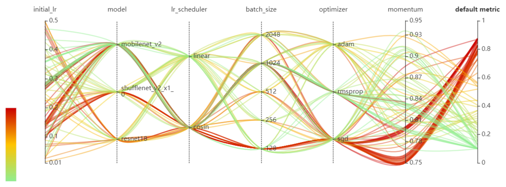

# 超参数自动调优实验

## 实验流程：
```
1.将训练代码中所需要调整的参数及其取值范围定义在search_space.jason文件中。
2.在训练代码中导入search_space.jason每次更新的参数，并将每个epoch的metric结果通过接口传入nni。
3.配置config.yml文件：
      设置多个GPU，同时允许在同一个GPU上同时运行多个不同的Trial，提升效率。
      配置assessor，当metric较差时，提前终止任务，提升效率。
4.在命令行启动nni
```

#### search_space.jason中，超参的选择：
初次实验时，将骨干 **model** 的待选类型设置为：`'resnet18'` `'resnet50'` `'vgg16'` `'vgg16_bn'` `'densenet121'` `'squeezenet1_1'` `'shufflenet_v2_x1_0'` `'mobilenet_v2'` `'resnext50_32x4d'` `'mnasnet1_0'`
由于cifar10数据集数量相对image net较少，且种类仅为10类。因此在第一次进行实验的时候，resnet50等大型网络，收敛速度较慢，测试效果并不好。所以将骨干网待选种类缩小为：`'resnet18'``'shufflenet_v2_x1_0'``'mobilenet_v2'`。其余参数如batch size,lr,optimizer等超参数，都选取常见值。针对学习率衰减，新加入了`step`衰减，与  `cosin`衰减方式进行比较。
#### 对模型文件导入模型的修改：
通过pytorch直接导入模型时，默认为1000分类，需要将最后的全连接部分改为10分类，减少模型参数。

## 实验结果：
#### 图1 精确度Top10

```

```
#### 图2 精确度Top1详细超参数

#### 图3 各类参数之间的影响

#### 图4 所有Trial的准确度曲线


## 实验总结
* 直接用骨干网训练，精度最高到了87.71%。
* `step`衰减方式和`cosin`衰减方式相比，前者更容易陷入局部最优，导致精确度不在继续提升，如4所示，很多精确度较差trial，精确度前期有提升，但是到25轮之后，精确度曲线变为直线，不再提升。
* 在优化器选择上，`SGD`的最终效果更好，`adam`优化器前期loss下降较快，但最终效果并不是最好。
