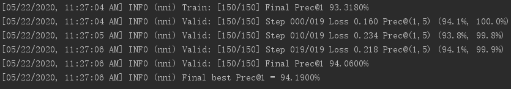

# NAS实验

## 实验流程：
* 1.将训练代码中设定合适的学习率、优化参数、网络层数、通道数等初始设置。
* 2.在训练代码的model文件中设定网络的**节点拓扑结构**和每个节点待选取的**操作类型**（如池化、深度可分离卷积等）。
* 3.运行`main_cifar10NAS.py`文件，开始神经网络架构搜索，并将每轮生成的网络参数结果保存在`./checkpoints_layer5`中(网络的搜索空间设置为5层)。
* 4.搜索程序结束后，依照生成网络结构参数，重新再数据训练一遍，测试最终的准确率（训练150轮）。
## 实验结果：
* 网络的最后10轮测试准确度为
```
[05/22/2020, 11:21:08 AM] INFO (nni) Valid: [141/150] Final Prec@1 94.0900%
[05/22/2020, 11:21:48 AM] INFO (nni) Valid: [142/150] Final Prec@1 93.9500%
[05/22/2020, 11:22:28 AM] INFO (nni) Valid: [143/150] Final Prec@1 94.0800%
[05/22/2020, 11:23:07 AM] INFO (nni) Valid: [144/150] Final Prec@1 93.9900%
[05/22/2020, 11:23:47 AM] INFO (nni) Valid: [145/150] Final Prec@1 94.0900%
[05/22/2020, 11:24:27 AM] INFO (nni) Valid: [146/150] Final Prec@1 94.1300%
[05/22/2020, 11:25:07 AM] INFO (nni) Valid: [147/150] Final Prec@1 94.0200%
[05/22/2020, 11:25:46 AM] INFO (nni) Valid: [148/150] Final Prec@1 94.0600%
[05/22/2020, 11:26:26 AM] INFO (nni) Valid: [149/150] Final Prec@1 94.0800%
[05/22/2020, 11:27:06 AM] INFO (nni) Valid: [150/150] Final Prec@1 94.0600%
```
* 网络最后一轮在训练集和测试集的准确度为:

* 训练集的准确度小于测试集的准确度，没有发生过拟合。
* 网络最终的准确率为94.06%，结果优于在任务一中直接使用的现有模型。

